# Credit_Risk_Analysis

## Overview
For this module, supervised machine learning algorithms were used to solve a real-world challenge: credit card risk.

## Results

### Naive Random Oversampling

#### Accuracy Score
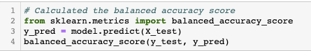

#### Confusion Matrix
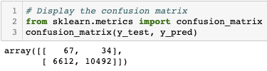

#### Imbalanced Classification Report
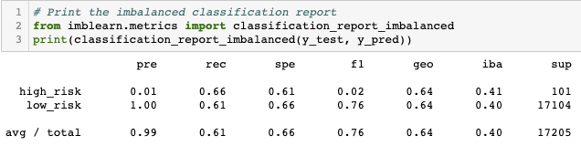

### SMOTE Oversampling

#### Accuracy Score
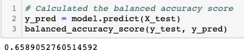

#### Confusion Matrix
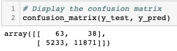

#### Imbalanced Classification Report
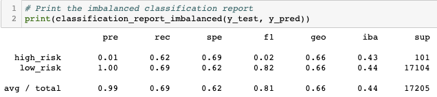

### Undersampling

#### Accuracy Score
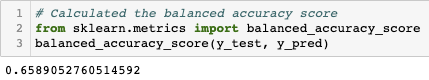

#### Confusion Matrix
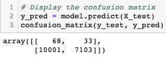

#### Imbalanced Classification Report
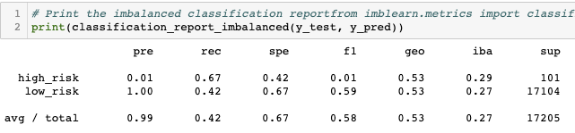

### Combination (Over and Under) Sampling

#### Accuracy Score
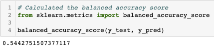

#### Confusion Matrix
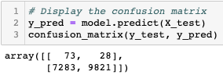

#### Imbalanced Classification Report
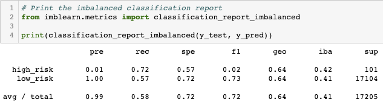

### Balanced Random Forest Classifier

#### Accuracy Score
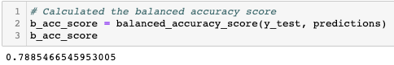

#### Confusion Matrix
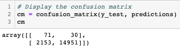

#### Imbalanced Classification Report
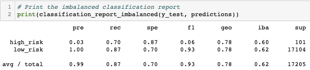

### Easy Ensemble AdaBoost Classifier

#### Accuracy Score
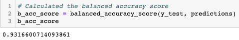

#### Confusion Matrix
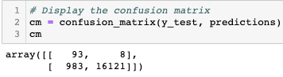

#### Imbalanced Classification Report
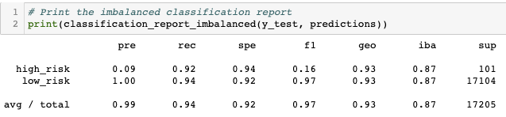
